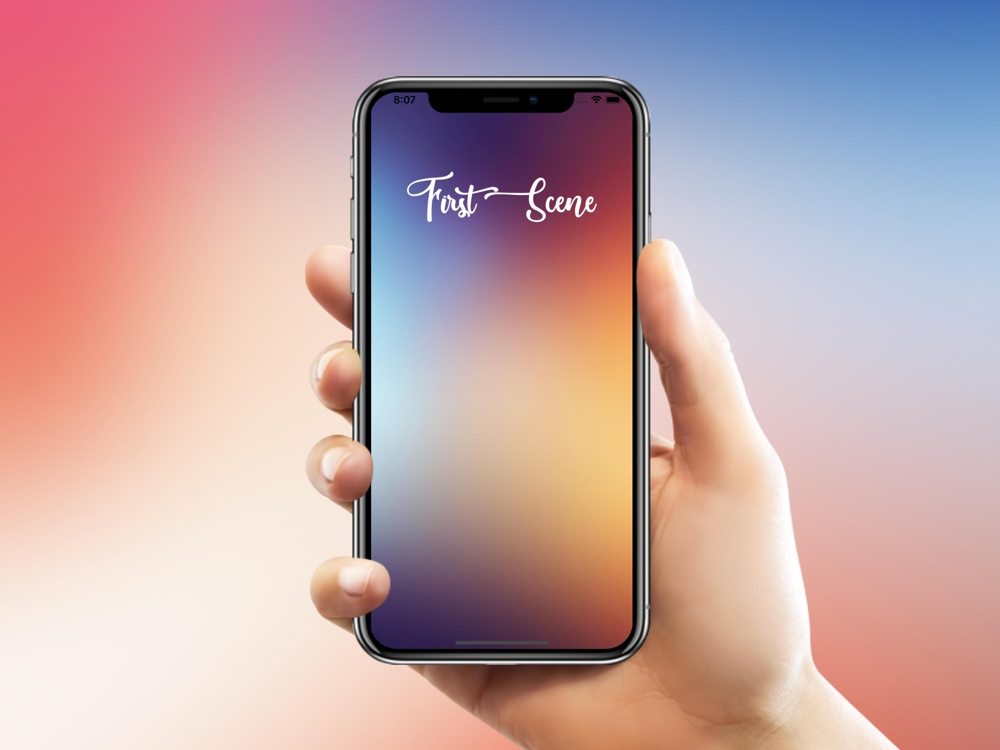

# Transition from scene to scene in SpriteKit
This whole project is created completely programmatically without .sks files and Xcodes Scene Edidor.

___
## Example how the UI looks
* First View Controller

